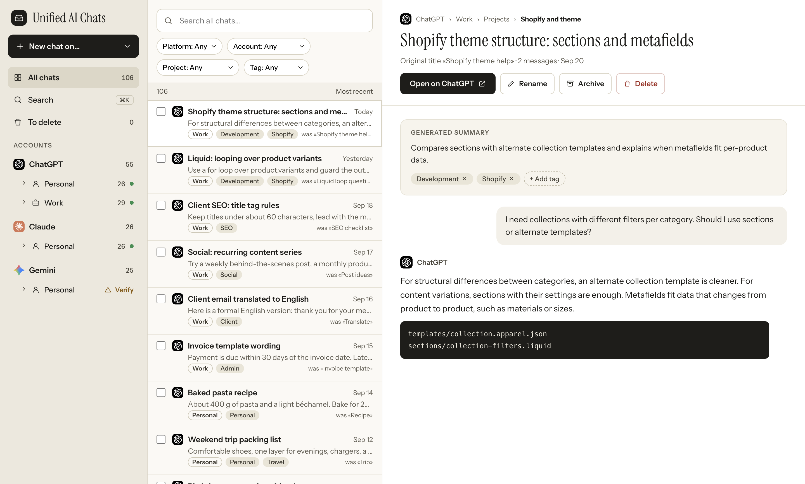

# Unified AI Chats

An open-source desktop app that works like an email client for your AI chats.

Connect your ChatGPT and Claude accounts (several per platform, e.g. Personal and Work) and the Claude Code sessions on your Mac, and get one local inbox with everything organized the way it is on each platform: chats, projects, archive, generated images. Search, tag, archive and sort everything in one place.



## Install

Most people only need this section: no Node, no npm, no terminal.

1. Open the [Releases page](https://github.com/jovaxxx/unified-ai-chats/releases) and download the installer for your computer:
   - **macOS:** `Unified-AI-Chats-<version>-mac-arm64.dmg` (Apple Silicon: M1 and later) or `…-mac-x64.dmg` (Intel).
   - **Windows:** `…-win-x64.exe` (**untested**).
   - **Linux:** `…-linux-x64.AppImage` or `.deb` (**untested**).
2. **macOS:** open the `.dmg` and drag **Unified AI Chats** onto the **Applications** folder.
3. Open the app (see the warning below the first time).


### The first time you open it (macOS)

The app is **not signed or notarized by Apple**, so macOS does not trust it and blocks it the first time. This is expected, and it is safe to allow **if you downloaded it from this repository's Releases page**.

What we checked on a real Mac (macOS 26, Apple Silicon): the app carries a valid ad-hoc signature (so it can run at all on Apple Silicon), and macOS's own check (`spctl`) reports it as **rejected**, meaning a downloaded copy is stopped until you allow it once. The exact wording of the dialogs on a freshly downloaded copy was not recorded; the steps below follow Apple's documented flow and may differ slightly between macOS versions:

1. Double-click the app. macOS says it cannot verify it and does not open it. Click **Done** (do not move it to the Bin).
2. Open **System Settings → Privacy & Security** and scroll down to **Security**.
3. Next to “Unified AI Chats was blocked to protect your Mac” click **Open Anyway**, then confirm with your password or Touch ID.
4. From now on the app opens normally.


You never need to turn off Gatekeeper or any other macOS protection, and you should not.

### Check your download (optional)

Each release has a `SHA256SUMS.txt`. Put it in the same folder as the installer and run:

```bash
shasum -a 256 -c SHA256SUMS.txt --ignore-missing   # macOS / Linux
```

On Windows (PowerShell): `Get-FileHash .\<installer>.exe -Algorithm SHA256`, then compare with the line in `SHA256SUMS.txt`.

### Your data

Everything (database, image previews, sign-in sessions) lives in your user folder, **outside** the app: on macOS `~/Library/Application Support/unified-ai-chats`. Installing a newer version over the old one keeps it, and the app makes a backup copy of the database (`unified-ai-chats.sqlite.backup-v<N>`) before it upgrades it. Deleting the app does not delete your data; delete that folder yourself if you want it gone.

## What it does

Latest release: **v0.1.2**. macOS (Apple Silicon and Intel) is tested; the Windows and Linux installers are built by CI and are **untested**.

- **Accounts:** ChatGPT and Claude through a sign-in window (one isolated session per profile; the app never sees your password), and Claude Code sessions read from `~/.claude/projects` (no login, no network). Profiles have free-text names, several per platform; an account that is already connected is recognised, so no duplicate is created.
- **First run:** a new install starts empty. The first sync of a new account starts by itself, and recent chats are refreshed in the background every few minutes and when the window comes back into focus.
- **Sync:** incremental, newest first, resumable, one independent sync per profile, with a progress line and a note when the platform asks it to slow down.
- **Organize:** chats, projects, archive and pinned chats as on each platform; tags; local rename; a Trash with a 14-day countdown; bulk select with archive, trash, restore and tag; eight sort orders; profiles and platforms in the order you choose; resizable columns; English and Italian; dark mode.
- **Search:** full-text search (SQLite FTS5) inside a profile or everywhere.
- **Reader:** assistant messages in Markdown as on the platform, the active branch of each conversation, an "Open on platform" button, and a copyable resume command for Claude Code.
- **Images:** generated ChatGPT images are shown from ChatGPT's own link, not downloaded: small cached previews, a gallery per profile and overall with search, project filter and date sort, and a Save image button for one image at a time.
- **Dashboard:** per platform and per profile: counts, chats per month, "to clean" suggestions, latest images.
- **Read-only:** the app only reads from the platforms; archive, rename, tag and delete change your local copy only.
- **Local-first:** no telemetry; data stays on your device, in your user folder.

More detail in [docs/architecture.md](docs/architecture.md).

## Build from source

For developers. Requires Node 24 or newer.

```bash
npm install
npm run dev      # Electron with hot reload
npm test         # unit and UI smoke tests
npm run build && npm start   # production build, run locally
npm run dist     # installers for this computer's platform, in release/ (see electron-builder.yml)
npm run dist:mac # macOS .dmg files (Apple Silicon and Intel)
```

`npm install` downloads the Electron binary (an install script). Packaging (name, id, icon) is configured in [`electron-builder.yml`](electron-builder.yml) and `assets/icon/`; the icon is a placeholder, regenerate the PNG from `icon.svg` with `npx electron scripts/make-icon.mjs`. A release is made by pushing a version tag (`v*`): the [release workflow](.github/workflows/release.yml) builds on macOS, Windows and Linux and attaches the installers and `SHA256SUMS.txt`.

## Architecture summary

TypeScript everywhere. Electron (isolated per-account sessions) + React + Vite. SQLite (`node:sqlite`, bundled with Node/Electron) with FTS5. One connector per platform reads that platform's web API; every response is validated with zod and mismatches stop the sync instead of guessing. Details in [docs/architecture.md](docs/architecture.md).

## Disclaimer

This project is **unofficial** and **not affiliated with OpenAI, Anthropic or Google**.

- It relies on **undocumented web endpoints** that can change without notice.
- Automating account actions **may violate a platform's terms of service** and can lead to account restrictions.
- **Use at your own risk**, preferably in read-only mode first.
- Logos are trademarks of their respective owners and are used only to identify the services.

## License

[MIT](LICENSE)
